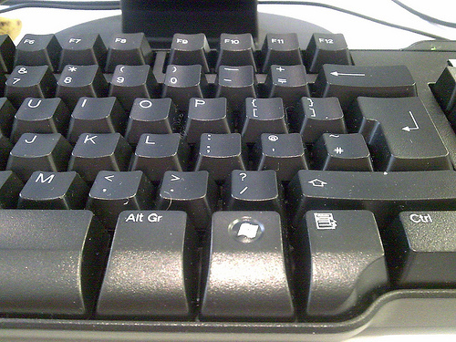

# Train ResNet on ImageNet in Tensorflow 2.0

## Accuracy

| Network | Center crop @ top-1  | 10-crop @ top-1 |
|:---------:|:------:|:------:|
| ResNet-18 | 69.15% | 71.60% |
| ResNet-50 | 75.96% | 77.72% |

Meet the accuracy in [Deep Residual Learning for Image Recognition](http://openaccess.thecvf.com/content_cvpr_2016/papers/He_Deep_Residual_Learning_CVPR_2016_paper.pdf).

The weights is provided.

Link: [https://pan.baidu.com/s/1nwvkt3Ei5Hp5Pis35cBSmA](https://pan.baidu.com/s/1nwvkt3Ei5Hp5Pis35cBSmA)

Code: y4wo

## Requirements
Python version: 3.5.1

Packages:
* Tensorflow 2.0.0
* numpy
* opencv-python
* tqdm

## Dataset

The ImageNet data can be downloaded from [http://www.image-net.org/](http://www.image-net.org/).

Or you can contact me for a download link of Baidu Netdisk.

If you want to train your own data, please modify all the files in data/ and config.py.

## Usage

#### Prepare

All training settings are in config.py. You can change the `log_file` and `save_weight_file` to set save path.

To use default config, you should create the directory before training.

```
mkdir result
mkdir result/log
mkdir result/weight
```

For the other parameters in config.py, it is not suggested to change them unless you know what you are doing.

#### Model

Various versions of ResNet, which is 18, 34, 50, 101 and 152, are implemented in Tensorflow 2.0
```python
from model.ResNet import ResNet
model = ResNet(50)
```

Or you can import the model in [keras applications](https://keras.io/applications/)
```python
from tensorflow.keras.applications.resnet50 import ResNet50
model = ResNet50(weights=None)
```

Set model in `train.py`, which defaults to ResNet-50 v2.

#### Training

`python3 train.py`

My experimental environment is 
* i7-6850K @ 3.6GHz
* TITAN Xp, 12GB

For ResNet-50, average training speed is 2 iterations per second. So it will take about 3 days to complete the training, which is 50 epochs.

If `Allocator (GPU_0_bfc) ran out of memory trying to allocate...`, please reduce the batch size.

#### Test

Set the `load_weight_file` in config.py.

In test code, images are resized such that the shorter side is 256. Then crop the 224*224 area as the input.

`python3 test.py` is center crop test.

`python3 test_10_crop.py` is standard 10-crop test mentioned in [Deep Residual Learning for Image Recognition](http://openaccess.thecvf.com/content_cvpr_2016/papers/He_Deep_Residual_Learning_CVPR_2016_paper.pdf).

`python3 test_single_image.py` is single image test. Set the image path and model path before run it. The final output is the category name and confidence.

For example, the input image is 



and the output is 
```

----------------------------------------
image: ILSVRC2012_val_00000321.JPEG
classification result:computer_keyboard
confidence:0.7444
----------------------------------------

```

## More

Basic tutorial for tensorflow 2.0: [https://github.com/Apm5/tensorflow_2.0_tutorial](https://github.com/Apm5/tensorflow_2.0_tutorial)

For chinese friends: 我有一个[知乎专栏](https://zhuanlan.zhihu.com/c_1183794276223385600)，里面有中文版本的教程

Contact me: lijiakun112@gmail.com